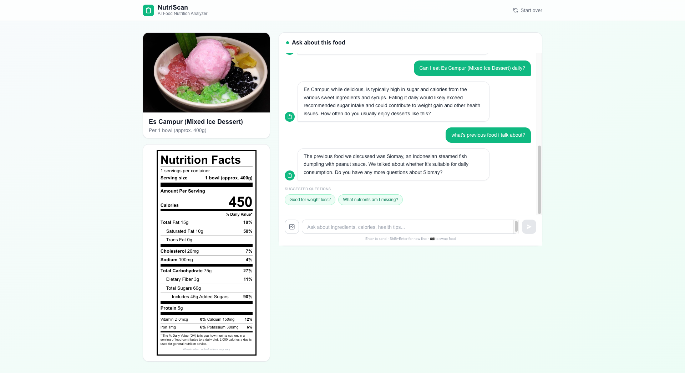

# NutriScan — AI Food Nutrition Analyzer



Upload a photo of any food and instantly get an FDA-format nutrition label plus a smart AI chat that helps you make healthier choices.

## Features

- **Photo Upload** — Drag & drop or click to upload any food image
- **FDA Nutrition Label** — Auto-generated label with calories, macros, vitamins, and % daily values
- **Streaming AI Chat** — Natural back-and-forth conversation about the food powered by Google Gemini
- **Conversation Memory** — Swap food images mid-chat; the AI remembers everything discussed
- **Health-Focused Advice** — Honest, practical guidance tailored to your goals (weight loss, allergies, diet)
- **Suggested Questions** — Proactive question chips to get you started
- **Mobile Responsive** — Tab layout on small screens switches between label and chat

## Tech Stack

- [Next.js 14](https://nextjs.org/) (App Router)
- [Tailwind CSS](https://tailwindcss.com/)
- [OpenRouter API](https://openrouter.ai/) — `google/gemini-2.5-flash`

## Getting Started

1. **Clone the repo**
   ```bash
   git clone https://github.com/darwishub/FoodApp.git
   cd FoodApp
   ```

2. **Install dependencies**
   ```bash
   npm install
   ```

3. **Set up environment variables**

   Create a `.env.local` file in the root:
   ```env
   OPENROUTER_API_KEY=your_openrouter_api_key_here
   ```
   Get your key at [openrouter.ai/keys](https://openrouter.ai/keys).

4. **Run the development server**
   ```bash
   npm run dev
   ```

   Open [http://localhost:3000](http://localhost:3000) in your browser.

## Project Structure

```
app/
├── api/
│   ├── analyze/route.ts        # Analyzes food image → nutrition JSON
│   └── chat/route.ts           # Streaming chat with image context
├── layout.tsx
└── page.tsx                    # Main page

components/
├── ChatInterface.tsx           # Streaming chat UI with suggestion chips
├── ImageUpload.tsx             # Drag & drop upload
├── NutritionLabel.tsx          # FDA-format label
└── NutritionLabelSkeleton.tsx  # Loading skeleton
```

## Notes

- Nutrition values are AI estimates and may vary from actual values
- The AI only answers food and nutrition-related questions
- All conversation history (including previous food images) is maintained in the chat context
